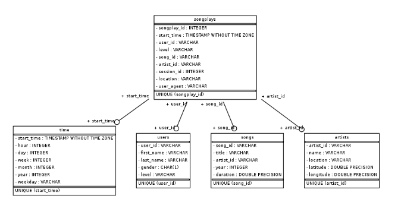

# Project-Data-Warehouse

# Project description: 

The goal of the project is to extract the data from AWS S3 to Redshift within two staging tables, and from the two staging tables create a set of fact/dimensional tables.

We know that every time a user of the music app plays a song, it is recorded on the json files within the folder `log_data` located in AWS S3 at `s3://udacity-dend/log_data`.
We also know that the information related to each song available on the music app is stored in the json files within the folder `song_data` located in AWS S3 at `s3://udacity-dend/song_data/A/A/A`.

# Database design: 

- **The staging table `staging_songs`:** each row holds the info relative to a json file located in `log_data` (located in AWS S3).

- **The staging table `staging_events`:** each row holds the info relative to a json file located in `song_data` (located in AWS S3).

- **The dimension table `songs`:** each row holds the info relative to a song available at the music app. PS: the column `song_id` is sortkey. The table is `Distribution all`.

- **The dimension table `artists`:** each row holds the info relative to an artist who create a song available at the music app. PS: the column artist_id is sortkey. The table is `Distribution all`.

- **The dimension table `time`:** each row holds the info relative to the instance when an user of the app played a song. PS: the column `start_time` is sortkey. The table is `Distribution all`.

- **The dimension table `users`:** each row holds the info relative to an user of the app that has played at leat one or several songs. PS: the column `user_id` is sortkey. The table is `Distribution all`.

- **The dimension fact `songplays`:** each row holds the info relative to when a song is played. PS: the column `start_time` is sortkey and distkey. 

# ETL Process: 
The information related to each song available on the music app is stored in the json files within the folder `song_data`.
Each file of `song_data` refres to one specific song.
So the program will extract the information from the files to the table songs and artists. The code does basically a copy/paste.

Every time an user of the music app plays a song, it is recorded on the json files within the folder `log_data`.
Each file of `log_data` refers to one specific day from November 2018.
So the program will extract the information from the files in `log_data` and will insert information in the `time and users` tables.
So the program will extract the information from the files in `log_data` and will insert information in the `time` and `users` tables. The code does basically a copy/paste with an extra query to the tables time and users in order to get the `song_id and artist_id`. 

# Project Repository files: 
**create_tables.py:** 
- Connect to the redshift cluster `redshift-cluster-1`
- Creates the empty tables `staging_songs and staging_events`
- Creates a set of empty fact/dimensional tables: `songs,artists,time,users,songplays`  

**etl.py:** 
- Connect to the redshift cluster `redshift-cluster-1`
- For each json file of `song_data` we insert the content in `staging_songs`.
- For each json file of `log_data` we insert the content in `staging_events`.
- We create the set of fact/dimensional tables from `staging_songs and staging_events`.

**sql_queries.py:**
- contains all the query needed by `create_tables.py` and `etl.py`

# How To Run the Project: This describes the steps to run the project
- run `create_tables.py` 
- run `etl.py`

